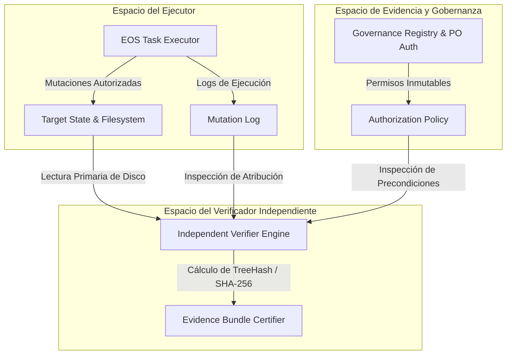

# EOS — LEVEL 3 GOVERNANCE PACKAGE
## Pilar 5 — Contrato de Verificador Independiente (Independent Verifier Contract)

**Estado:** `PROPOSAL — NOT AUTHORIZED`

**Autonomy Execution Status:** `BLOCKED`

**Target Scope:** Control Plane Sandboxed Fixtures Only

**Production / GATE-13:** `CLOSED`

**Precedent Baseline:** `FINDING-L2-002` Remediation & SHA-256 Parity Protocol

---

## 1. Propósito y Filosofía

Erradicar el riesgo de **contaminación de evidencia** y certificar que **el componente ejecutor nunca sea la única autoridad que valide su propio trabajo**.

> **Invariante Cardinal del Pilar 5:**  
> $$\mathbf{\text{Executor} \neq \text{Sole Certifier}}$$  
> $$\mathbf{\text{Imposibilidad de Verificar} \neq \text{Verificación Aprobada}}$$  
> Cualquier fallo, alteración, indisponibilidad o discrepancia de hash en el verificador **invalida automáticamente la certificación del ciclo activo** y detiene la marcha (`VERIFICATION_BLOCKED`).

---

## 2. Arquitectura de Desacoplamiento e Independencia



---

## 3. Los 10 Invariantes de Independencia del Verificador

```text
┌─────────────────────────────────────────────────────────────────────────────┐
│                 INVARIANTES DEL VERIFICADOR INDEPENDIENTE                   │
├─────────┬───────────────────────────────────────────────────────────────────┤
│ IV-I01  │ El ejecutor no puede ser el único certificador de su propia tarea.│
│ IV-I02  │ La identidad del verificador está fijada criptográficamente (hash)│
│ IV-I03  │ La identidad del verificador permanece estable durante el ciclo.  │
│ IV-I04  │ El verificador consume exclusivamente estado observable primario. │
│ IV-I05  │ El perímetro (scope) se evalúa de manera independiente y ciega.   │
│ IV-I06  │ Toda mutación física es atribuible 1:1 de forma independiente.     │
│ IV-I07  │ La validez de autorización y revocación se comprueba en tiempo real│
│ IV-I08  │ La restauración por rollback se certifica con paridad matemática. │
│ IV-I09  │ La integridad de la cadena de evidencia se valida sin mutaciones. │
│ IV-I10  │ El fallo o caída del verificador nunca puede producir certificación│
└─────────┴───────────────────────────────────────────────────────────────────┘
```

---

## 4. Especificación de Secciones (IV-001 a IV-012)

### IV-001 — Desacoplamiento Arquitectónico Real

- Queda estrictamente prohibido que una función o agente que realiza mutaciones de código en el target emita por sí misma el veredicto final de `VERIFIED`.
- El verificador debe operar como un proceso separado o arnés aislado que inspecciona el resultado material en el sistema de archivos contra el modelo de autorización.

---

### IV-002 & IV-003 — Identidad Criptográfica y Fijación de Hash (Pinning)

El verificador posee una identidad criptográfica inmutable capturada antes de iniciar la sesión:

$$\text{VerifierIdentity} = \langle \text{VerifierVersion}, \text{VerifierScriptHash}_{\text{SHA-256}}, \text{SchemaHash}_{\text{SHA-256}}, \text{ConfigHash}_{\text{SHA-256}} \rangle$$

**Regla de Oro:**
$$\text{Hash}_{\text{Pre-Execution}} == \text{Hash}_{\text{At-Verification}} \quad (\Delta = 0)$$

Cualquier mutación en el archivo del verificador durante la sesión provoca la invalidación inmediata de toda la evidencia producida.

---

### IV-004 — Paridad Temporal durante Todo el Ciclo

Se registra la cadena de custodia temporal:
- $T_0$: Captura y congelamiento del hash del verificador.
- $T_1$: Inicio de la tarea autorizada.
- $T_2$: Mutación física en el target.
- $T_3$: Ejecución del verificador independiente.

$$\forall t \in [T_0, T_3], \quad \text{Hash}(\text{Verifier})_t == \text{Hash}(\text{Verifier})_{T_0}$$

---

### IV-005 — Separación Estricta de Espacios de Entrada (Input Separation)

Se establecen 4 espacios de entrada disjuntos con permisos de escritura estrictamente segregados:

| Espacio de Entrada | Contenido | Quién Puede Escribir | Quién Puede Leer |
|---|---|---|---|
| **`GOVERNANCE_INPUTS`** | Autorizaciones, DAG, Decision Gates | Product Owner / Governance | Verificador / Ejecutor |
| **`EXECUTION_INPUTS`** | Código fuente, specs, templates | SDD / Agente Ejecutor | Ejecutor / Verificador |
| **`TARGET_STATE`** | Sistema de archivos en el repositorio target | Agente Ejecutor (bajo scope) | Verificador / Ejecutor |
| **`VERIFICATION_INPUTS`** | Schemas, reglas del verificador, baseline | Control Plane (Congelado) | Verificador exclusivamente |

El ejecutor tiene prohibido escribir en `GOVERNANCE_INPUTS` o `VERIFICATION_INPUTS`.

---

### IV-006 — Independencia de Evidencia (Primary Sources Only)

El verificador rechaza aserciones subjetivas del ejecutor (ej. *"I tested and it works"*). La certificación se deriva exclusivamente de fuentes primarias observables:
1. Contenido binario y texto de los archivos en disco.
2. Árbol de Git local (`git diff`, `git log`, `git status`).
3. Logs de salida de comandos con código de salida (`exit code 0`).
4. Telemetría de procesos y monitoreo de puertos/red (Egress monitor).

---

### IV-007 — Verificación Independiente del Perímetro Tripartito

El verificador audita de forma ciega todo path modificado en el target contra la tupla autorizada:

$$\forall p \in \text{ModifiedPaths} \implies p \in \text{AuthorizedFiles} \lor p \in \text{AuthorizedMetadataDirs}$$

Si un archivo fue modificado dentro de un `authorized_container_dirs` pero no está explícitamente en `authorized_files`, el veredicto es **`SCOPE_VIOLATION_FAIL`**.

---

### IV-008 — Atribución 1:1 de Mutaciones

El verificador exige la tupla de causalidad completa para cada mutación física:
$$\text{MutationProof} = \langle \text{WHAT}, \text{WHO}, \text{WHICH\_TASK}, \text{WHICH\_AUTH}, \text{WHEN}, \text{WHY} \rangle$$

Si existe una mutación en disco huérfana (sin correspondencia en el DAG), la certificación queda cancelada.

---

### IV-009 — Verificación Independiente de Rollback

El verificador independiente calcula de forma autónoma el `TreeHash` post-rollback y valida:
1. $\text{TreeHash}_{\text{Current}} == \text{TreeHash}_{\text{Pre-Flight}}$.
2. La supervivencia intacta de la evidencia del fallo previo.
3. Que el estado del proyecto se encuentre en `AWAITING_REAUTH` (y no en `AUTHORIZED`).

---

### IV-010 — Verificación Temporal de Autorización

El verificador valida la estampa de tiempo de las mutaciones contra la línea de vida de la autorización:
$$\text{Timestamp}(\text{Mutation}) < \text{Timestamp}(\text{Revocation}) \lor \mathbf{FAIL}$$

Mutaciones efectuadas tras una señal de revocación se clasifican como desacato de gobernanza (`GOVERNANCE_BREACH`).

---

### IV-011 — Semántica de Fallo del Verificador

Ante cualquiera de las siguientes condiciones:
- El verificador arroja excepción o código de salida distinto de 0.
- El hash del verificador ha cambiado.
- Se detecta pérdida de conexión con una fuente primaria.
- La evidencia provista es incompleta o truncada.

El sistema emite el veredicto **`VERIFICATION_UNAVAILABLE`**, bloquea la emisión de certificados y detiene el pipeline. **Bajo ninguna circunstancia la falla del verificador se asume como éxito.**

---

### IV-012 — Taxonomía de Estados de Certificación

```text
               ┌──────────────────────────────┐
               │    ESTADOS DE CERTIFICACIÓN  │
               └──────────────┬───────────────┘
                              │
     ┌────────────────┬───────┴────────┬──────────────────┐
     ▼                ▼                ▼                  ▼
[VERIFIED]     [NOT VERIFIED]  [PARTIALLY VERIFIED] [VERIFICATION BLOCKED]
Evidencia      Inconsistencia  Evidencia parcial    Verificador caído,
matemática     o fallo de      sin cobertura de     hash alterado o
completa       invariante      casos límite         evidencia corrupta
```

El estado **`CERTIFIED`** se reserva exclusivamente para cuando todos los criterios obligatorios alcanzan el estado `VERIFIED`.

---

## 5. Pruebas Adversariales contra el Verificador (IV-TEST-001 a IV-TEST-007)

| ID Escenario | Ataque Inyectado contra el Verificador | Reacción del Contrato | Veredicto Final |
|---|---|---|---|
| **`IV-TEST-001`** | Modificación del script verificador antes de ejecutar. | Detección de Hash Mismatch | `CERTIFICATION_DENIED` |
| **`IV-TEST-002`** | Modificación en caliente del verificador durante la corrida. | Invalidación Inmediata de Ciclo | `CERTIFICATION_DENIED` |
| **`IV-TEST-003`** | Intento de sustitución del binario/módulo verificador. | Fallo de Cripto-Pinning | `CERTIFICATION_DENIED` |
| **`IV-TEST-004`** | Inyección de aserciones de evidencia falsificadas. | Rechazo por falta de fuente primaria | `CERTIFICATION_DENIED` |
| **`IV-TEST-005`** | Presentación de autorización expirada o revocada. | Detección de Invalidez Temporal | `CERTIFICATION_DENIED` |
| **`IV-TEST-006`** | Intento de enmascaramiento de path (Scope Spoofing). | Detección de Violación de Perímetro | `CERTIFICATION_DENIED` |
| **`IV-TEST-007`** | Simulación de crash/indisponibilidad del verificador. | Transición a `VERIFICATION_BLOCKED` | `CERTIFICATION_DENIED` |

---

## 6. Estado de Este Documento

```text
DOCUMENT STATUS:          PROPOSAL — NOT AUTHORIZED
LEVEL 3 EXECUTION:        BLOCKED
EXTERNAL TARGET WRITE:    FROZEN
GATE-13 (PROD):           CLOSED
NEXT GOVERNANCE STEP:     CROSS-PILLAR CONSISTENCY AUDIT (P1..P5)
```

---

## 7. Decisión Requerida

La adopción formal de este contrato como estándar del Verificador Independiente de Nivel 3 requiere la aprobación del Product Owner y la ejecución de la auditoría cruzada de consistencia entre los 5 pilares.
