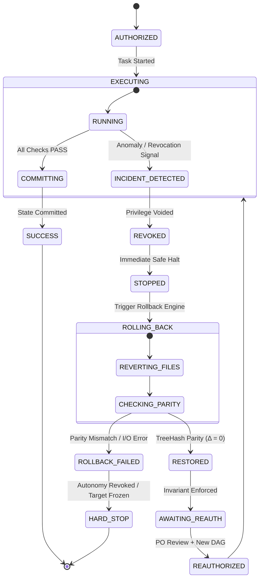

# EOS — LEVEL 3 GOVERNANCE PACKAGE
## Pilar 4 — Protocolo de Reversión y Revocación (Rollback & Revocation Protocol)

**Estado:** `PROPOSAL — NOT AUTHORIZED`

**Autonomy Execution Status:** `BLOCKED`

**Target Scope:** Control Plane Sandboxed Fixtures Only

**Production / GATE-13:** `CLOSED`

**Precedent Baseline:** Rollback Strategy & Target Mutation Boundary

---

## 1. Propósito y Filosofía

Garantizar que EOS posea mecanismos deterministas, atómicos y verificables para **detener una ejecución en caliente, revocar privilegios y restaurar el sistema a su línea base exacta ($\Delta = 0$) ante cualquier anomalía o señal de gobernanza**.

> **Invariante Cardinal del Pilar 4:**  
> $$\mathbf{RESTORED \neq AUTHORIZED}$$  
> La recuperación física del sistema de archivos **nunca reanuda privilegios de ejecución automáticamente**. Un estado post-rollback queda siempre en `AWAITING_REAUTH`.

---

## 2. Máquina de Estados Formal de Rollback y Revocación



---

## 3. Los 10 Invariantes de Reversión y Revocación

```text
┌─────────────────────────────────────────────────────────────────────────────┐
│                      INVARIANTES DE REVERSIÓN Y REVOCACIÓN                  │
├─────────┬───────────────────────────────────────────────────────────────────┤
│ RR-I01  │ La revocación domina estrictamente sobre autorizaciones previas.  │
│ RR-I02  │ Una ejecución revocada no puede consolidar (commit) mutaciones.   │
│ RR-I03  │ Un estado de incidente nunca reanuda por auto-continue.           │
│ RR-I04  │ El rollback restaura exactamente la línea base declarada (Δ = 0). │
│ RR-I05  │ Todo fallo de rollback provoca HARD_STOP inmediato y congelamiento│
│ RR-I06  │ La evidencia del fallo sobrevive intacta al rollback.             │
│ RR-I07  │ La integridad del verificador debe preservarse tras el rollback.   │
│ RR-I08  │ La autorización previa muere con el rollback (RESTORED ≠ AUTH).   │
│ RR-I09  │ La restauración exitosa exige certificación desacoplada e indep. │
│ RR-I10  │ La reautorización post-incidente exige RCA formal y nuevo DAG.    │
└─────────┴───────────────────────────────────────────────────────────────────┘
```

---

## 4. Especificación de Secciones (RR-001 a RR-012)

### RR-001 — State Model & Transiciones

El ciclo de vida ante fallos se rige por transiciones discretas y no ambiguas:
- **`AUTHORIZED:`** Autorización explícita otorgada para un DAG cerrado.
- **`EXECUTING:`** Proceso activo en ejecución.
- **`REVOKED:`** Señal de revocación recibida; cancelación de permisos en disco.
- **`STOPPED:`** Subprocesos detenidos en punto seguro (*safe execution point*).
- **`ROLLING_BACK:`** Reversión física atómica en progreso.
- **`RESTORED:`** Línea base recuperada al 100%; transiciona automáticamente a `AWAITING_REAUTH`.
- **`ROLLBACK_FAILED:`** Error en restauración física; transiciona a `HARD_STOP`.

---

### RR-002 — Snapshot / Baseline Contract

Antes de ejecutar la primera mutación de cualquier tarea de Nivel 3, el sistema captura obligatoriamente el **Pre-Flight Snapshot Bundle**:

$$\text{Snapshot}_0 = \langle \text{TreeHash}_0, \text{GitHead}_0, \text{AuthHash}_0, \text{DAGHash}_0, \text{VerifierHash}_0, \text{EvidenceChainHash}_0 \rangle$$

Si la captura del snapshot falla o es incompleta, la tarea se aborta antes de tocar el sistema de archivos.

---

### RR-003 — Semántica de Revocación Temporal

1. **Pre-Ejecución:**
   $$T_{\text{revoke}} > T_{\text{auth}} \implies \mathbf{DENIED}$$
2. **Pre-Commit:**
   $$T_{\text{revoke}} < T_{\text{commit}} \implies \mathbf{ABORT\_COMMIT}$$
3. **En Vuelo (In-Flight):**
   $$T_{\text{revoke}} \in [T_{\text{start}}, T_{\text{end}}] \implies \mathbf{HALT \rightarrow INCIDENT \rightarrow ROLLBACK}$$

---

### RR-004 — Immediate Stop Semantics

Ante una señal de revocación o fallo de invariante:
1. **Bloqueo de I/O:** El barrier de escritura se cierra inmediatamente (`DISALLOW_WRITES`).
2. **Safe Point Halt:** Los subprocesos en ejecución reciben señal `SIGINT`/`SIGTERM` y se detienen en un punto seguro (máximo timeout: 3000ms antes de `SIGKILL`).
3. **Congelamiento de Telemetría:** Se captura el estado del error para la evidencia antes de revertir.

---

### RR-005 — Scope y Granularidad del Rollback

El motor de rollback opera bajo el **Principio de Mínimo Radio de Impacto Suficiente**:

| Nivel de Rollback | Alcance de Reversión | Cuándo Aplica |
|---|---|---|
| **`TASK_ROLLBACK`** | Archivos mutados por la tarea activa exclusivamente. | Fallo de sintaxis o scope acotado a la tarea. |
| **`DAG_ROLLBACK`** | Reversión de la tarea activa y sus dependencias directas. | Fallo de contrato entre tareas encadenadas. |
| **`TRANSACTION_ROLLBACK`** | Reversión completa del lote de tareas en vuelo. | Anomalía de gobernanza o revocación del PO. |
| **`PROJECT_ROLLBACK`** | Restauración total al snapshot pre-flight de inicio de sesión. | Ataque adversarial, corrupción o escape de scope. |

---

### RR-006 — Atomicidad y Consistencia (All-or-Nothing)

- El rollback es **estrictamente atómico**: no se admiten restauraciones parciales.
- Si una operación modificó 5 archivos, el rollback debe restaurar los 5.
- Si 4 archivos son restaurados pero 1 falla por bloqueo de I/O, el estado es **`ROLLBACK_FAILED`** y el sistema entra en **`HARD_STOP`**.

---

### RR-007 — Verificación de Paridad Criptográfica (TreeHash)

El criterio físico de éxito del rollback exige paridad matemática exacta:

$$\Delta_{\text{TreeHash}} = \left| \text{TreeHash}(\text{Current}) - \text{TreeHash}(\text{Snapshot}_0) \right| = 0$$
$$\Delta_{\text{VerifierHash}} = 0$$
$$\Delta_{\text{AuthHash}} = 0$$

---

### RR-008 — Preservación de Evidencia y Cadena de Custodia

El rollback revierte el sistema de archivos del target, **pero preserva permanentemente la evidencia del incidente en el Control Plane**:

```text
[EVD-PREFLIGHT-XXX]
        │
        ▼
 [INCIDENT OCCURS]
        │
        ▼
[EVD-INCIDENT-XXX] (Registra la anomalía, actor, stack trace y payload)
        │
        ▼
 [ROLLBACK RUNS]
        │
        ▼
[EVD-ROLLBACK-XXX] (Registra los archivos revertidos y el delta TreeHash)
        │
        ▼
[EVD-RESTORED-XXX] (Certifica el retorno a la línea base segura)
```

---

### RR-009 — Estado Posterior: `AWAITING_REAUTH`

- Tras un rollback exitoso, el proyecto entra en **`AWAITING_REAUTH`**.
- La autorización previa que originó el incidente queda **extinta e invalidada**.
- El Control Plane prohíbe el lanzamiento de nuevas tareas hasta que se registre una nueva autorización formal.

---

### RR-010 — Protocolo de Reautorización Post-Incidente

Para salir de `AWAITING_REAUTH`, se requiere el siguiente pipeline humano/gobernanza:

```text
1. [INCIDENT ROOT CAUSE ANALYSIS (RCA)]
                  ↓
2. [REVISED SPECIFICATION / TASKS DAG]
                  ↓
3. [PRODUCT OWNER EXPLICIT SIGN-OFF]
                  ↓
4. [NEW PRE-FLIGHT SNAPSHOT]
                  ↓
5. [RE-EXECUTION AUTHORIZED]
```

---

### RR-011 — Gestión de Fallo de Rollback (`HARD_STOP`)

Si el rollback falla (`ROLLBACK_FAILED`):
1. **Revocación Total de Autonomía:** El nivel de autonomía se degrada inmediatamente a `PROHIBITED`.
2. **Target Freeze:** El target se marca como `CORRUPTED_TARGET_LOCKED`.
3. **Alarma y Diagnóstico:** Emisión del reporte `ROLLBACK_FAILURE_INCIDENT.json` con la lista exacta de descriptores de archivo bloqueados para intervención manual.

---

### RR-012 — Verificación Desacoplada e Independiente

La certificación del rollback debe ser realizada por un componente auditor independiente del ejecutor:

$$\text{Executor}(\text{Rollback}) \longrightarrow \text{Target Restored} \longrightarrow \text{IndependentAuditor}(\text{Verify TreeHash \& Git})$$

---

## 5. Escenarios de Prueba Obligatorios del Harness (RR-TEST-001 a RR-TEST-007)

| ID Escenario | Condición Inyectada | Reacción Requerida | Estado Final Esperado |
|---|---|---|---|
| **`RR-TEST-001`** | Revocación previa al inicio de tarea. | `DENIED_PRE_FLIGHT` | `AUTHORIZED_CANCELLED` |
| **`RR-TEST-002`** | Revocación inyectada durante ejecución activa. | `HALT_IN_FLIGHT` | `RESTORED / AWAITING_REAUTH` |
| **`RR-TEST-003`** | Rollback tras mutación fuera de scope. | `TRAP_AND_ROLLBACK` | `RESTORED / AWAITING_REAUTH` |
| **`RR-TEST-004`** | Simulación de fallo de I/O en rollback. | `ABORT_AND_LOCK` | `ROLLBACK_FAILED / HARD_STOP` |
| **`RR-TEST-005`** | Verificación de supervivencia de evidencia post-rollback. | `EVIDENCE_CHAIN_INTACT` | `VERIFIED_CHAIN` |
| **`RR-TEST-006`** | Intento de manipulación de verificador durante incidente. | `AUDIT_CORRUPTION_TRAP` | `HARD_STOP` |
| **`RR-TEST-007`** | Ciclo completo de Reautorización tras rollback exitoso. | `RCA_AND_REAUTH` | `REAUTHORIZED` |

---

## 6. Estado de Este Documento

```text
DOCUMENT STATUS:          PROPOSAL — NOT AUTHORIZED
LEVEL 3 EXECUTION:        BLOCKED
EXTERNAL TARGET WRITE:    FROZEN
GATE-13 (PROD):           CLOSED
NEXT GOVERNANCE PILLAR:   INDEPENDENT VERIFIER CONTRACT (Pilar 5)
```

---

## 7. Decisión Requerida

La adopción formal de este protocolo como estándar de Nivel 3 requiere la aprobación explícita del Product Owner y su validación cruzada con los Pilares 1, 2, 3 y 5.
