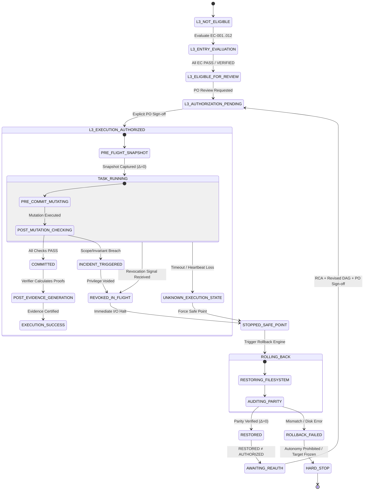

# EOS — LEVEL 3 GOVERNANCE PACKAGE
## Especificación Canónica de Estados, Trazabilidad e Invariantes Cruzadas (P1..P5)

**Estado:** `PROPOSAL — NOT AUTHORIZED`

**Autonomy Execution Status:** `BLOCKED`

**Target Scope:** Control Plane Sandboxed Fixtures Only

**Production / GATE-13:** `CLOSED`

**Propósito:** Cerrar formalmente las 4 brechas semánticas identificadas en la Auditoría Cruzada de Consistencia (Cross-Pillar Consistency Audit v1) y actuar como **Fuente Canónica Única de Verdad (Single Source of Truth)** para los Pilares 1 a 5.

---

## 1. Máquina de Estados Global Canónica (`STATE_MACHINE_CANONICAL`)

Se prohíbe el uso de estados ad-hoc en cualquiera de los pilares. Todo evento debe mapear estrictamente a uno de los siguientes estados discretos canónicos:



### Tabla Canónica de Estados

| Estado Canónico | Dominio | Semántica | Permite Mutación |
|---|---|---|---|
| **`L3_NOT_ELIGIBLE`** | Elegibilidad | Criterios de entrada incompletos o fallidos. | 🔴 NO |
| **`L3_ENTRY_EVALUATION`** | Elegibilidad | Proceso de evaluación activa de EC-001..012. | 🔴 NO |
| **`L3_ELIGIBLE_FOR_REVIEW`** | Elegibilidad | Elegible para ser revisado por el PO. | 🔴 NO |
| **`L3_AUTHORIZATION_PENDING`**| Gobernanza | En espera de firma explícita del PO. | 🔴 NO |
| **`L3_EXECUTION_AUTHORIZED`** | Gobernanza | Permiso otorgado para un DAG inmutable cerrado. | 🟢 SÍ (Dentro de Scope) |
| **`PRE_FLIGHT_SNAPSHOT`** | Ejecución | Captura de hash base antes de mutar. | 🔴 NO |
| **`TASK_RUNNING`** | Ejecución | Subproceso activo bajo monitoreo. | 🟢 SÍ (Dentro de Scope) |
| **`COMMITTED`** | Transaccional | Mutación validada en disco local. | 🔴 NO |
| **`EXECUTION_SUCCESS`** | Cierre | Evidencia generada y certificada. | 🔴 NO |
| **`REVOKED_IN_FLIGHT`** | Incidente | Señal de revocación o trampa activada. | 🔴 NO (I/O Locked) |
| **`UNKNOWN_EXECUTION_STATE`** | Incidente | Pérdida de telemetría o timeout. | 🔴 NO (I/O Locked) |
| **`STOPPED_SAFE_POINT`** | Incidente | Subprocesos detenidos con seguridad. | 🔴 NO |
| **`ROLLING_BACK`** | Recuperación | Motor de reversión restaurando disco. | 🟡 Solo Reversión |
| **`RESTORED`** | Recuperación | Restauración física al 100% ($\Delta=0$). | 🔴 NO |
| **`AWAITING_REAUTH`** | Gobernanza | Sistema limpio pero desautorizado. | 🔴 NO |
| **`ROLLBACK_FAILED`** | Fallo Crítico | Error físico en restauración. | 🔴 NO |
| **`HARD_STOP`** | Fallo Crítico | Congelamiento total y degradación a L0. | 🔴 NO |

---

## 2. Semántica de Incidente por Fases Transaccionales

Se resuelve la semántica exacta del momento de detección de un incidente:

```text
┌─────────────────────────────────────────────────────────────────────────────┐
│                    INCIDENTES POR FASE TRANSACCIONAL                        │
├──────────────────────────┬──────────────────────────────────────────────────┤
│ 1. PRE-COMMIT INCIDENT   │ Detección de trampa antes de asentar mutación:   │
│                          │ Aborta mutación en memoria, congela y revierte.  │
├──────────────────────────┼──────────────────────────────────────────────────┤
│ 2. POST-MUTATION INCIDENT│ Detección tras escribir archivo pero pre-commit: │
│                          │ Invoca TASK_ROLLBACK atómico con TreeHash Δ=0.   │
├──────────────────────────┼──────────────────────────────────────────────────┤
│ 3. POST-COMMIT INCIDENT  │ Detección de fallo semántico tras commit local:  │
│                          │ Invoca DAG_ROLLBACK / Git Reset al Pre-Flight.   │
├──────────────────────────┼──────────────────────────────────────────────────┤
│ 4. POST-EVIDENCE INCIDENT│ Detección de manipulación posterior de evidencia:│
│                          │ Invalida evidencia, congela y pasa a HARD_STOP.  │
└──────────────────────────┴──────────────────────────────────────────────────┘
```

---

## 3. Semántica ante Estados Desconocidos, Timeouts y Caída de Heartbeat

> **Invariante Cardinal:**  
> $$\mathbf{\text{Ausencia de Telemetría} \neq \text{Éxito}}$$  
> $$\mathbf{\text{Pérdida de Heartbeat} \implies \text{UNKNOWN\_EXECUTION\_STATE} \implies \text{STOP \& RECONCILE}}$$

Si se pierde la comunicación con el ejecutor o expira el timeout de una tarea (default: 30.000 ms):
1. El runtime corta la autoridad de I/O inmediatamente.
2. Se envía `SIGKILL` a los subprocesos colgados.
3. El estado transiciona a **`UNKNOWN_EXECUTION_STATE`**.
4. Se ejecuta una **Reconciliación Independiente a Ciegas:**
   - Si el filesystem fue alterado sin commit certificado $\implies$ `TRIGGER ROLLBACK` $\rightarrow$ `RESTORED` $\rightarrow$ `AWAITING_REAUTH`.
   - Si el filesystem está intacto $\implies$ `TRANSITION TO AWAITING_REAUTH` con reporte de timeout.

---

## 4. Ciclo de Vida de Invalidación Retroactiva de Evidencia

Se formaliza el ciclo de vida de evidencias cuando se detecta un compromiso posterior del verificador o de la cadena de custodia:

```mermaid
graph TD
    V[VERIFIED (Histórico)] -->|Verificador Comprometido / Hash Drift| INV[INVALIDATED]
    V -->|Superada por Evidencia Fresca| SUP[SUPERSEDED]
    
    INV --> INC[EMIT EVIDENCE_INTEGRITY_INCIDENT]
    INV --> PRE[PRESERVE AS FORENSIC AUDIT ASSET]
    
    style INV fill:#ff9999,stroke:#ff0000,stroke-width:2px;
    style V fill:#99ff99,stroke:#00aa00,stroke-width:2px;
```

**Reglas de Invalidación:**
- Una evidencia `INVALIDATED` **no se borra jamás** del Control Plane; se marca inmutablemente con su causa forense.
- Todo certificado que dependía de una evidencia `INVALIDATED` queda revocado en cascada.
- Se prohíbe categorizar una evidencia invalidada como simple `NOT VERIFIED`; su estado formal es **`INVALIDATED`**.

---

## 5. Frontera entre Observabilidad de Red y Acceso a Red

Se establece la separación taxativa entre generar tráfico y observar el entorno:

$$\mathbf{NETWORK\_ACCESS = STRICTLY\_PROHIBITED \quad (Para\ Agentes\ y\ Ejecutores)}$$
$$\mathbf{NETWORK\_OBSERVABILITY = ALLOWED\_PASSIVE \quad (Exclusivo\ para\ Auditores\ y\ Monitores)}$$

```text
┌─────────────────────────────────────────────────────────────────────────────┐
│                 MATRIZ DE PRIVILEGIOS DE RED Y TELEMETRÍA                   │
├───────────────────────────────┬──────────────────────┬──────────────────────┤
│ Operación                     │ Ejecutor / Agentes   │ Verificador / Auditor│
├───────────────────────────────┼──────────────────────┼──────────────────────┤
│ Abrir Sockets TCP/UDP         │ 🔴 PROHIBIDO         │ 🔴 PROHIBIDO         │
│ Enviar Peticiones HTTP/HTTPS  │ 🔴 PROHIBIDO         │ 🔴 PROHIBIDO         │
│ Egress hacia Internet / Cloud │ 🔴 PROHIBIDO         │ 🔴 PROHIBIDO         │
│ Inspeccionar Socket Netstat   │ 🔴 PROHIBIDO         │ 🟢 PERMITIDO PASIVO  │
│ Capturar Conexiones Abiertas  │ 🔴 PROHIBIDO         │ 🟢 PERMITIDO PASIVO  │
│ Verificar Tráfico Egress = 0  │ 🔴 PROHIBIDO         │ 🟢 PERMITIDO PASIVO  │
└───────────────────────────────┴──────────────────────┴──────────────────────┘
```

---

## 6. Raíz de Confianza del Verificador Independiente (Root of Trust)

Para erradicar la regresión infinita (*¿quién audita al auditor?*), se define la **Raíz de Confianza Exógena**:

```text
       [CONSTITUCIÓN EOS + PRODUCT OWNER] (Trust Root Exógeno)
                       │
                       ▼
    [CONGELAMIENTO DE LÍNEA BASE Y HASH SHA-256]
                       │
                       ▼
          [INDEPENDENT VERIFIER ENGINE]
                       │
                       ▼
            [CERTIFICACIÓN DE TAREAS]
```

1. **Autoridad Raíz:** La firma del Product Owner en `GOVERNANCE.md` y el hash SHA-256 congelado en el changelog institucional (`EOS_VERIFIER_CHANGE_LOG.md`).
2. **Inmutabilidad:** El verificador no se autocertifica; se ejecuta contra el hash congelado derivado de la Raíz de Confianza.
3. **Quiebre de Cadena:** Si el hash en disco no coincide con la Raíz de Confianza, el sistema aborta antes de evaluar cualquier tarea.

---

## 7. Estado de Este Documento

```text
DOCUMENT STATUS:          PROPOSAL — NOT AUTHORIZED
LEVEL 3 EXECUTION:        BLOCKED
EXTERNAL TARGET WRITE:    FROZEN
GATE-13 (PROD):           CLOSED
NEXT GOVERNANCE STEP:     CROSS-PILLAR CONSISTENCY AUDIT v2 (FINAL)
```
