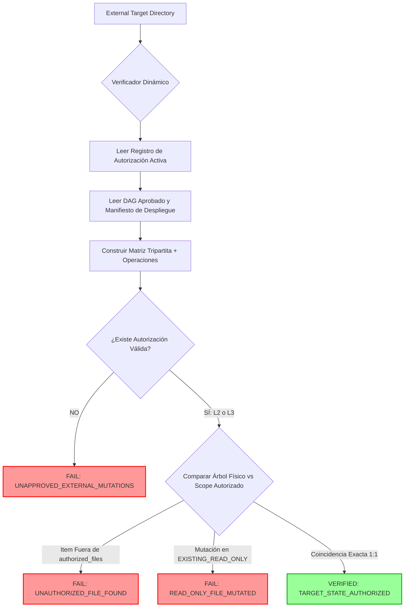

# PROPUESTA DE EVOLUCIÓN DEL VERIFICADOR — EOS CONTROL PLANE
## PROP-VRF-002: Verificación Dinámica de Targets Externos Consciente de Autorización

**Identificador de Propuesta:** `PROP-VRF-002`  
**Identificador de Hallazgo:** `FINDING-L3-VRF-001`  
**Fecha:** 2026-08-14  
**Estado:** **`PROPOSAL — AWAITING PO AUTHORIZATION`**  
**Target:** `scripts/verify-eos.js` (Solo lectura en esta fase — 0 modificaciones)  
**Target Externo (`Fundacion`):** `FROZEN`  
**Producción / Gate-13:** `CLOSED`

---

## 1. Declaración del Problema y Causa Raíz

- **Hallazgo:** Durante la ejecución de `DAG-L3-FUNDACION-PILOT-V2`, las 7 tareas operacionales del piloto se ejecutaron con éxito en `PRJ-FUNDACION`, pero `npm run verify:strict` falló con:
  ```text
  [FAILED] ExternalTarget:Fundacion: External target contains unapproved items outside Level 2 scope: tests
  ```
- **Causa Raíz Arquitectónica:** El verificador congelado (`scripts/verify-eos.js` SHA-256 `EFDDD623...`) contiene una lista estática de cadenas codificada para el alcance histórico de **Nivel 2** (`authorizedRootItems = ['.editorconfig', '.gitignore', '.git', 'deployment.manifest.json', 'index.html', 'package.json', 'src']`).
- **Problema de Diseño:** El verificador actual asume:
  $$\text{ExpectedExternalTargetScope} \equiv \text{Level 2 Legacy Scope}$$
  cuando el sistema requiere que evalúe:
  $$\text{ExpectedExternalTargetScope} \equiv \text{ResolveScope}(\text{ActiveAuthorization}, \text{ApprovedDAG}, \text{TripartiteModel})$$

---

## 2. Nueva Arquitectura: Pipeline de Verificación Consciente de Autorización



---

## 3. Los 10 Invariantes del Verificador Dinámico (`VRF-L3-I01` a `VRF-L3-I10`)

```text
┌─────────────────────────────────────────────────────────────────────────────┐
│                 INVARIANTES DEL VERIFICADOR CONSCIENTE DE AUTORIZACIÓN      │
├───────────┬─────────────────────────────────────────────────────────────────┤
│ VRF-L3-I01│ El verificador DEBE evaluar la autorización activa del proyecto │
│           │ y no una constante fija de scope histórico.                     │
│ VRF-L3-I02│ Sin autorización formal registrada, ninguna escritura externa es│
│           │ considerada válida (requiere 0 archivos en el target).          │
│ VRF-L3-I03│ Un path permitido en una autorización NO se convierte en un     │
│           │ path globalmente permitido para otros proyectos o niveles.      │
│ VRF-L3-I04│ El scope de contenedor no confiere autoridad de archivo.        │
│ VRF-L3-I05│ Los permisos por operación se evalúan independientemente de los │
│           │ permisos de ruta (READ_ONLY vs MODIFY vs CREATE).               │
│ VRF-L3-I06│ La evolución del verificador NO puede expandir privilegios por sí│
│           │ misma ni saltarse compuertas.                                   │
│ VRF-L3-I07│ El hash SHA-256 del verificador DEBE ser congelado antes de     │
│           │ cualquier certificación formal.                                 │
│ VRF-L3-I08│ Cualquier modificación al verificador invalida el ciclo actual  │
│           │ de certificación y exige una nueva cadena de evidencia.         │
│ VRF-L3-I09│ La evidencia histórica permanece inmutable (no se sobrescribe). │
│ VRF-L3-I10│ Un fallo de verificación sigue siendo un fallo; queda prohibido │
│           │ el fallback condescendiente a un PASS falso.                    │
└───────────┴─────────────────────────────────────────────────────────────────┘
```

---

## 4. Matriz de Validación del Verificador (5 Casos de Prueba)

| Caso | Escenario Evaluado | Autorización Simulada | Estado Físico del Target | Veredicto Requerido |
|---|---|---|---|---|
| **Caso A** | **Regresión Nivel 2:** Target L2 con carpeta `tests/` no autorizada | `LEVEL_2_CONTROLLED_WRITE` | Contiene `tests/` | 🔴 **`FAIL`** (Evita regresión L2) |
| **Caso B** | **Validación Nivel 3:** Target L3 con DAG V2 y `tests/unit/dom.test.js` | `LEVEL_3_CONTROLLED_AUTONOMY` | Contiene `tests/unit/dom.test.js` | 🟢 **`PASS`** (Reconoce L3 legítimo) |
| **Caso C** | **Anti-Expansión L3:** Target L3 con archivo espurio no declarado | `LEVEL_3_CONTROLLED_AUTONOMY` | Contiene `tests/unit/theme.test.js` | 🔴 **`FAIL`** (Bloquea no declarados)|
| **Caso D** | **Anti-Escalamiento Contenedor:** Item arbitrario en carpeta permitida | `LEVEL_3_CONTROLLED_AUTONOMY` | Contiene `tests/foo.js` | 🔴 **`FAIL`** (Contenedor $\neq$ Archivo)|
| **Caso E** | **Frontera de Operación:** Mutación sobre archivo de solo lectura | `LEVEL_3_CONTROLLED_AUTONOMY` | `index.html` modificado | 🔴 **`FAIL`** (Protege inmutables)  |

---

## 5. Protocolo de Transición y Congelamiento del Verificador

```text
ESTADO ACTUAL (v1.2):
- Hash SHA-256: EFDDD623CE83B0669479ABA0CC6676DD64573B94EAA681D8B30CAA861B57FCBD
- Limitación: Rígido a Nivel 2

PROPUESTA DE TRANSICIÓN (v1.3):
1. PO aprueba formalmente PROP-VRF-002 mediante compuerta de decisión.
2. Se implementa la resolución dinámica en scripts/verify-eos.js.
3. Se ejecutan los 5 casos de la matriz de validación del verificador.
4. Se calcula el nuevo hash SHA-256 y se congela en EOS_VERIFIER_CHANGE_LOG.md.
5. Se re-ejecuta npm run verify:strict bajo el nuevo hash para certificar el Control Plane.
```

---

## 6. Estado Actual de la Propuesta

```text
COMPUERTA:              DECISION-GATE-VRF-002 (PENDIENTE)
MODIFICACIÓN DE CÓDIGO: BLOQUEADA (scripts/verify-eos.js permanece congelado)
ESTADO DE FUNDACIÓN:    100% FROZEN
PRODUCCIÓN / GATE-13:   CLOSED
```
