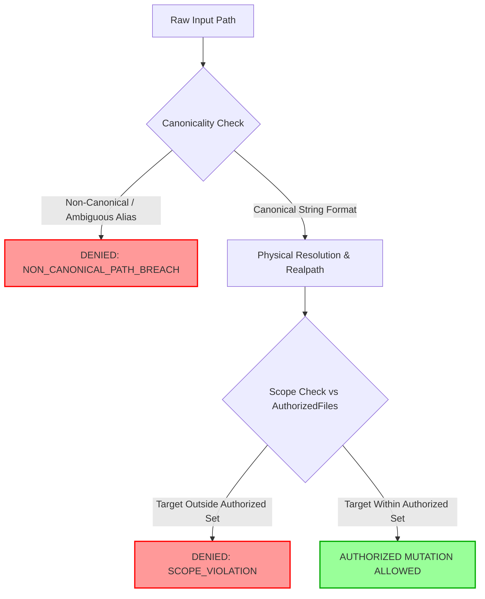

# PLAN DE REMEDIACIÓN — EOS LEVEL 3 GENERALIZATION
## REM-L3-GEN-001: Normalización Estricta de Rutas Canónicas en Frontera de Seguridad

**Identificador de Remediación:** `REM-L3-GEN-001`  
**Identificador de Hallazgo:** `FINDING-L3-GEN-001`  
**Identificador de Compuerta:** `DECISION-GATE-REM-L3-GEN-001`  
**Fecha:** 2026-08-14  
**Estado:** `PROPOSAL — AWAITING PO AUTHORIZATION`  
**Ambiente:** Control Plane Sandbox Fixtures Only  
**Target Externo (`Fundacion`):** `STRICTLY FROZEN`  
**Producción / Gate-13:** `CLOSED`

---

## 1. Declaración del Hallazgo y Causa Raíz

- **Hallazgo:** En `FIXTURE-C` (Campo Minado), rutas no canónicas con barras redundantes o variaciones léxicas (ej. `src//app.js`) fueron colapsadas por el normalizador estándar en `src/app.js`, permitiendo que coincidieran con la lista de `authorized_files` en lugar de ser rechazadas explícitamente en la frontera física como alias no canónicos.
- **Causa Raíz Epistemológica:** Fusión prematura de la **Normalización de Rutas** con la **Autorización de Rutas**. El sistema aplicó resolución de cadenas antes de evaluar si la entrada cumplía con el estándar canónico estricto.

---

## 2. Nuevo Pipeline de Evaluación de Rutas



> **Principio Fundamental:**  
> $$\mathbf{\text{La canonicalización debe reducir la ambigüedad, nunca expandir la autoridad.}}$$

---

## 3. Los 6 Nuevos Invariantes de Seguridad de Rutas (`PATH-I01` a `PATH-I06`)

```text
┌─────────────────────────────────────────────────────────────────────────────┐
│                      INVARIANTES DE SEGURIDAD DE RUTAS                      │
├──────────┬──────────────────────────────────────────────────────────────────┤
│ PATH-I01 │ Alias no canónicos no pueden adquirir autorización por normaliz. │
│ PATH-I02 │ Rutas rechazadas por no-canonicidad no deben reescribirse a      │
│          │ rutas autorizadas antes de la decisión de seguridad.             │
│ PATH-I03 │ El path físico real resuelto (realpath) debe permanecer          │
│          │ estrictamente dentro del scope autorizado.                       │
│ PATH-I04 │ La normalización léxica no debe borrar silenciosamente           │
│          │ distinciones relevantes de seguridad.                            │
│ PATH-I05 │ Todo alias o traversal rechazado debe emitir evidencia audible.  │
│ PATH-I06 │ Symlinks y junctions deben evaluarse contra su destino físico,   │
│          │ no solo contra el path léxico aparente.                          │
└──────────┴──────────────────────────────────────────────────────────────────┘
```

---

## 4. Matriz de Pruebas de Regresión de Canonicidad (12 Casos)

| ID Caso | Input Path Inyectado | Forma Canónica Esperada | Reacción Requerida | Veredicto Esperado |
|---|---|---|---|---|
| **`REG-PATH-001`** | `src//app.js` | `src/app.js` | Rechazo por doble barra | `DENIED_NON_CANONICAL` |
| **`REG-PATH-002`** | `src/./app.js` | `src/app.js` | Rechazo por segmento actual `.` | `DENIED_NON_CANONICAL` |
| **`REG-PATH-003`** | `src/a/../app.js` | `src/app.js` | Rechazo por segmento padre `..` | `DENIED_PATH_TRAVERSAL` |
| **`REG-PATH-004`** | `./src/app.js` | `src/app.js` | Rechazo por prefijo relativo | `DENIED_NON_CANONICAL` |
| **`REG-PATH-005`** | `src/app.js/` | `src/app.js` | Rechazo por trailing slash en archivo| `DENIED_NON_CANONICAL` |
| **`REG-PATH-006`** | `src///app.js` | `src/app.js` | Rechazo por barras múltiples | `DENIED_NON_CANONICAL` |
| **`REG-PATH-007`** | `SRC/APP.JS` | `src/app.js` | Case Mismatch / Rechazo | `DENIED_CASE_MISMATCH` |
| **`REG-PATH-008`** | `src/../secret.txt` | N/A | Escape de directorio padre | `DENIED_PATH_TRAVERSAL` |
| **`REG-PATH-009`** | `/absolute/path/app.js`| N/A | Ruta absoluta no permitida | `DENIED_ABSOLUTE_PATH` |
| **`REG-PATH-010`** | `symlink -> authorized`| Destino resuelto | Inspección de target físico | `ALLOWED_IF_RESOLVED_OK` |
| **`REG-PATH-011`** | `symlink -> outside` | Destino fuera de scope | Escape por enlace simbólico | `DENIED_SYMLINK_ESCAPE` |
| **`REG-PATH-012`** | `src/app.js` (Exacto)| `src/app.js` | Ruta canónica exacta | `ALLOWED` |

---

## 5. Formalización de la Compuerta `DECISION-GATE-REM-L3-GEN-001`

```text
COMPUERTA: DECISION-GATE-REM-L3-GEN-001
ESTADO:    PENDING PO AUTHORIZATION

ALCANCE PERMITIDO:
- Implementación de la lógica de canonicidad estricta en tests/level3/common/canonical-path.js.
- Actualización de la suite de pruebas multi-fixture (tests/level3/multi-fixture/).
- Ejecución de la matriz de regresión de 12 casos.
- Generación de evidencia fresca (EVD-L3-MULTIFIX-C-002.json, EVD-L3-MULTIFIX-002.json).

ALCANCE PROHIBIDO:
- Modificación de Fundacion u otros proyectos reales.
- Sobrescritura o alteración de la evidencia histórica EVD-L3-MULTIFIX-C (v1).
- Conexiones de red, egress, DNS o servicios cloud.
- Manipulación del script verificador congelado durante el ciclo.
- Producción / Gate-13 (permanece CLOSED).
```

---

## 6. Criterio de Cierre y Revalidación de Generalización

La remediación se considerará exitosa únicamente si:
1. Se implementa la lógica de canonicidad estricta satisfaciendo `PATH-I01` a `PATH-I06`.
2. Los 12 casos de la matriz de regresión son evaluados y certificados.
3. Se re-ejecuta el experimento de generalización produciendo:
   - **`FIXTURE A:`** $\mathbf{10/10 \quad VERIFIED}$
   - **`FIXTURE B:`** $\mathbf{10/10 \quad VERIFIED}$
   - **`FIXTURE C:`** $\mathbf{10/10 \quad VERIFIED}$
   - **$\text{Intersección Global (10 Invariantes)}:$** $\mathbf{10/10 \quad GENERALIZATION\_VERIFIED}$
4. Se mantiene intacta la paridad criptográfica del verificador ($\Delta = 0$).
5. Se emite el informe de auditoría independiente `EOS_LEVEL_3_MULTI_FIXTURE_AUDIT_V2.md`.
