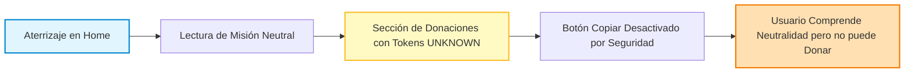

# MAPAS DE VIAJE DEL USUARIO (USER JOURNEYS) — PRJ-FUNDACION
## Comparativa: Experiencia Actual vs Experiencia Deseada de Alto Impacto

**Identificador:** `VAL-JRN-FND-001`  
**Fecha:** 2026-08-14  
**Proyecto:** `PRJ-FUNDACION`  
**Estatus:** `JOURNEY MAP BENCHMARKED`

---

## 1. Journey Actual (Línea Base Post-Remediación)



- **Punto Fuerte Actual:** La página es rápida, accesible y no engaña al usuario (neutralidad REM-001A garantizada).
- **Punto de Dolor Actual:** Al estar los datos bancarios y de contacto en estado `UNKNOWN` (`GAP-001` / `GAP-002`), el usuario **no puede completar el flujo transaccional ni contactar a la entidad**.

---

## 2. Journey Deseado (Experiencia de Alto Valor)

```mermaid
graph TD
    A[1. Descubrimiento & Aterrizaje Inmediato (<800ms)] --> B[2. Comprensión Instantánea de la Causa en el Hero]
    B --> C[3. Validación Rápida de Confianza: NIT, Personería y Testimonios Reales]
    C --> D{4. Decisión del Usuario}
    
    D -->|Desea Donar| E[5a. Flujo de Donación Transparente: Copia 1-Click / Pasarela Segura]
    D -->|Desea Ayudar| F[5b. Flujo de Voluntariado: Formulario Ágil de 3 Campos]
    D -->|Desea Contactar| G[5c. Conexión Directa: Botón WhatsApp / Email Institucional]
    
    E --> H[6. Confirmación de Recepción y Mensaje de Agradecimiento]
    F --> H
    G --> H
    
    style A fill:#e8f5e9,stroke:#388e3c,stroke-width:2px;
    style C fill:#e1f5fe,stroke:#0288d1,stroke-width:2px;
    style E fill:#e8f5e9,stroke:#388e3c,stroke-width:2px;
    style H fill:#f3e5f5,stroke:#7b1fa2,stroke-width:2px;
```

---

## 3. Mapa de Reducción de Fricción y Carga Cognitiva

| Etapa del Viaje | Fricción Típica en ONGs | Solución Propuesta en EOS (`VAL-I02`) |
|---|---|---|
| **Aterrizaje** | Muros de texto interminables y sliders pesados. | Hero limpio, propuesta de valor en 1 frase, carga sin layout shift (CLS < 0.05). |
| **Confianza** | Falta de información legal o datos ocultos. | Badge visible de Registro Legal, NIT y enlace a estados de transparencia. |
| **Donación** | Formularios que piden datos personales innecesarios. | Copia de cuenta bancaria con feedback visual inmediato sin salir de la página. |
| **Contacto** | Formularios de correo que nadie responde. | Enlace directo a WhatsApp institucional y teléfono verificado. |
