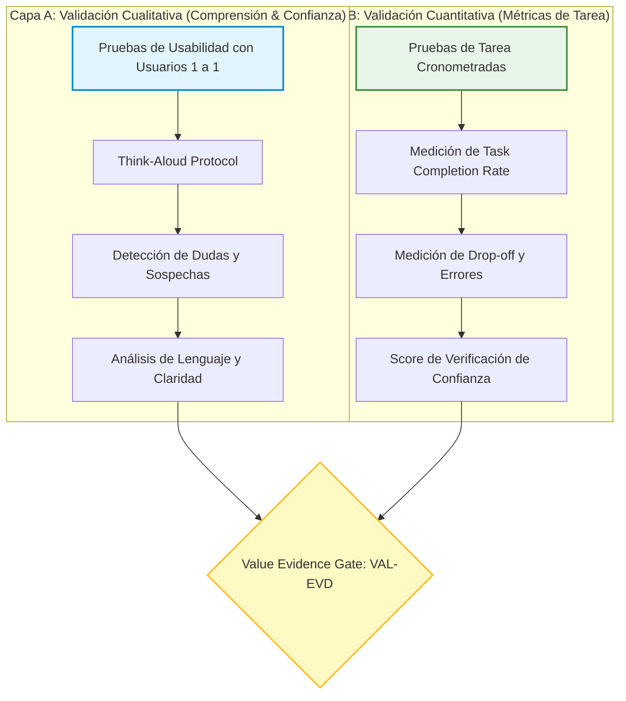

# PROTOCOLO DE VALIDACIÓN CON USUARIOS — PRJ-FUNDACION
## Plan de Experimentación Cualitativa y Cuantitativa del Value Plane

**Identificador:** `VAL-PROTO-FND-001`  
**Fecha:** 2026-08-14  
**Proyecto:** `PRJ-FUNDACION`  
**Estatus:** **`PROPOSAL — AWAITING PO VALIDATION AUTHORIZATION`**  
**Modo:** `READ_ONLY / RESEARCH_ONLY`  
**Target Físico (`Fundacion`):** `100% FROZEN (0 mutaciones)`

---

## 1. Estructura de la Validación en Dos Capas



---

## 2. Los 5 Escenarios de Prueba de Usuario

### Escenario 1: Evaluación de Legitimidad (`VAL-TEST-01`)
- **Instrucción al Usuario:** *"Imagina que acabas de enterarte de esta Fundación en redes. Revisa el sitio y dime: ¿Quiénes son y cómo sabes si son una entidad real y legalmente constituida?"*
- **Qué se evalúa:** Dónde busca el usuario las credenciales, si entiende el NIT, si la ausencia de información real le genera desconfianza.
- **Evidencia Esperada:** `VAL-EVD-001`.

### Escenario 2: Intención de Donación y Copia de Cuenta (`VAL-TEST-02`)
- **Instrucción al Usuario:** *"Deseas donar $20.000 COP a la causa. Encuentra la forma de hacerlo y copia los datos necesarios para tu transferencia bancaria."*
- **Qué se evalúa:** Fricción visual, comprensión del titular de la cuenta, efectividad del botón de copia, dudas sobre el destino del dinero.
- **Evidencia Esperada:** `VAL-EVD-002` y `VAL-EVD-003`.

### Escenario 3: Contacto Directo (`VAL-TEST-03`)
- **Instrucción al Usuario:** *"Tienes una duda sobre los programas comunitarios y deseas hablar con alguien de la Fundación hoy mismo. ¿Cómo lo harías?"*
- **Qué se evalúa:** Facilidad para encontrar el canal de WhatsApp o correo, expectativas sobre el tiempo de respuesta.
- **Evidencia Esperada:** `VAL-EVD-004`.

---

## 3. Protocolo de Transición hacia Decisiones de Producto

```text
RESULTADOS DEL PILOTO DE VALIDACIÓN
   │
   ▼
ANÁLISIS EPISTÉMICO DE EVIDENCIA (VAL-EVD)
   │
   ├── Hipótesis Confirmadas ──> Requisitos de Producto Formales
   ├── Hipótesis Falsadas ────> Pivot de UX / Rediseño de Flujo
   └── Nuevos Gaps Hallados ──> Registro en GAP Register
   │
   ▼
AUTORIZACIÓN DE CAMBIOS EN CONTROL PLANE (Siguiente Fase)
```
