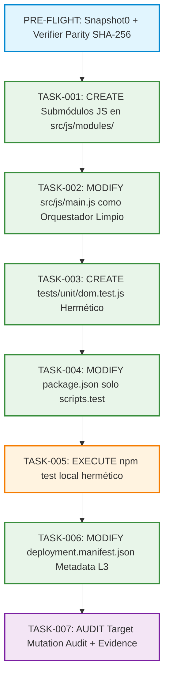

# REGISTRO DE PROPUESTA DE PILOTO REAL — PRJ-FUNDACION (V2)
## Propuesta de DAG Encadenado y Matriz de Permisos por Operación (Nivel 3)

**Identificador de Propuesta:** `PROP-L3-FUNDACION-REAL-V2`  
**DAG ID:** `DAG-L3-FUNDACION-PILOT-V2`  
**Fecha:** 2026-08-14  
**Proyecto Target:** `PRJ-FUNDACION` (`C:\Users\valen\Documents\Fundacion`)  
**Estatus:** `PROPOSAL — AWAITING PO DECISION-GATE-L3-REAL-001`  
**Modo de Operación:** `LEVEL_3_CONTROLLED_REAL_PILOT`  
**Escritura en Repositorio Real:** `BLOCKED (Hasta autorización explícita)`  
**Producción / Gate-13:** `CLOSED`

---

## 1. Matriz Granular de Permisos por Operación y Path

Se erradica la ambigüedad clasificando taxativamente cada ruta entre **Existente Solo Lectura**, **Existente con Mutación Delimitada** y **Nueva Creación Autorizada**:

```text
┌─────────────────────────────────────────────────────────────────────────────┐
│                 MATRIZ DE PERMISOS POR OPERACIÓN Y PATH (V2)                │
├──────────────────────────┬──────────────────────┬───────────────────────────┤
│ Path                     │ Categoría            │ Operaciones Permitidas    │
├──────────────────────────┼──────────────────────┼───────────────────────────┤
│ .gitignore               │ EXISTING_READ_ONLY   │ READ ONLY                 │
│ .editorconfig            │ EXISTING_READ_ONLY   │ READ ONLY                 │
│ index.html               │ EXISTING_READ_ONLY   │ READ ONLY (INMUTABLE)     │
│ src/styles/main.css      │ EXISTING_READ_ONLY   │ READ ONLY (INMUTABLE)     │
│ src/config/legal.json    │ EXISTING_READ_ONLY   │ READ ONLY (GAP-002 PROT.) │
├──────────────────────────┼──────────────────────┼───────────────────────────┤
│ package.json             │ EXISTING_MODIFY      │ READ, MODIFY (scripts.test│
│                          │                      │ exclusivamente; NO deps)  │
│ src/js/main.js           │ EXISTING_MODIFY      │ READ, MODIFY (Orquestador)│
│ deployment.manifest.json │ EXISTING_MODIFY      │ READ, MODIFY (Metadata L3)│
├──────────────────────────┼──────────────────────┼───────────────────────────┤
│ src/js/modules/dom.js    │ NEW_CREATE           │ CREATE, READ              │
│ src/js/modules/theme.js  │ NEW_CREATE           │ CREATE, READ              │
│ src/js/modules/clipboard │ NEW_CREATE           │ CREATE, READ              │
│ tests/unit/dom.test.js   │ NEW_CREATE           │ CREATE, READ (Test único) │
└──────────────────────────┴──────────────────────┴───────────────────────────┘
```

> **PROTECCIONES ESTRICTAS:**
> - `index.html`, `legal.json` y `main.css` permanecen **estrictamente de solo lectura**, garantizando la neutralidad semántica alcanzada en `REM-001A`.
> - `package.json` solo permite mutación en la clave `scripts.test`. **Cero instalación o alteración de dependencias.**

---

## 2. DAG Encadenado y Trazabilidad de Tareas (`DAG-L3-FUNDACION-PILOT-V2`)



---

## 3. Modelo Tripartito Consolidado

- **`authorized_files` (12 archivos):** 8 existentes + 3 módulos JS + 1 test unitario hermético.
- **`authorized_metadata_dirs` (1 directorio):** `.git/`.
- **`authorized_container_dirs` (7 directorios):** `src/`, `src/styles/`, `src/config/`, `src/js/`, `src/js/modules/`, `tests/`, `tests/unit/`.
- **`forbidden_scope`:** Todo path no listado, operaciones no concedidas a su categoría, conexiones de red, secretos, DNS o producción.

---

## 4. Estado de la Propuesta

```text
COMPUERTA:              DECISION-GATE-L3-REAL-001 (PENDIENTE)
ESTADO DE EJECUCIÓN:    BLOCKED
TARGET FUNDACION:       100% FROZEN (0 mutaciones)
PRODUCCIÓN / GATE-13:   CLOSED
```
